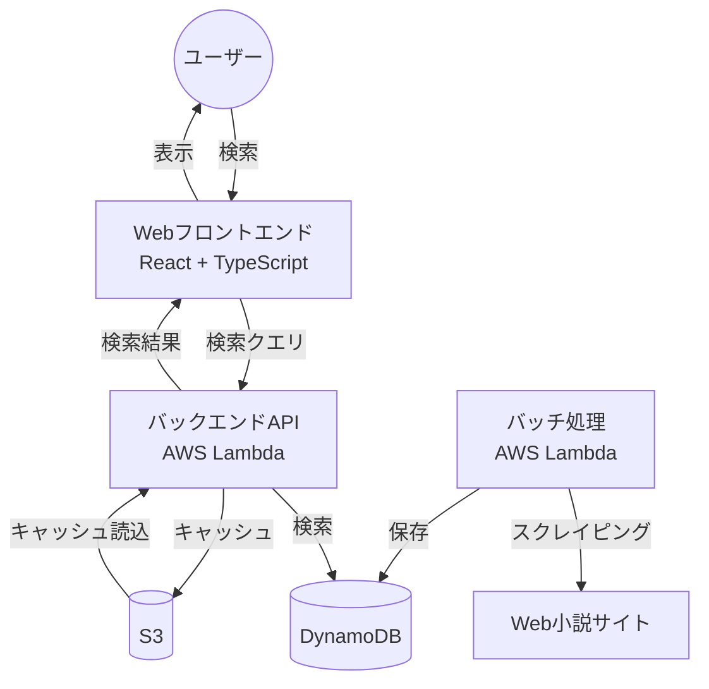
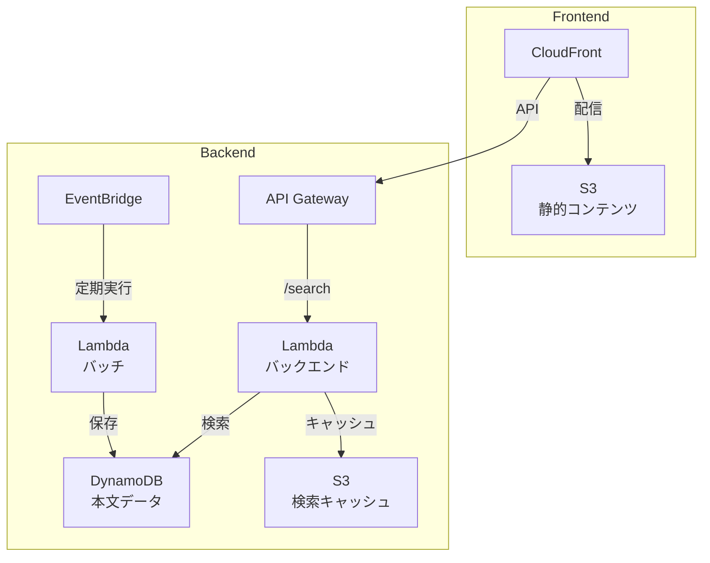

# WebNovelGrepper

[デモ環境](https://ymat19.com/WebNovelGrepper/)

Web小説サイトの全文検索を実現するアプリケーションです。

## アーキテクチャ概要

このアプリケーションは以下の3つのコンポーネントで構成されています：

1. **バッチ処理 (AWS Lambda)**
   - Web小説サイトから本文データを定期的にスクレイピング
   - BeautifulSoup4を使用してHTMLをパース
   - 取得したデータをDynamoDBに保存

2. **バックエンド (AWS Lambda)**
   - フロントエンドからのクエリを受け付け
   - DynamoDBに対して全文検索を実行
   - 大きな検索結果はS3にキャッシュ
   - APIレスポンスサイズは6MB以下に制限

3. **フロントエンド (React + Vite + TypeScript)**
   - 検索クエリの入力UI
   - 検索結果の表示
   - 検索文字列のハイライト表示
   - 設定情報の表示（About画面）
   - レスポンシブデザイン（Chakra UI）

## 主な機能

- 指定した作品内での全文検索
- 複数キーワードのAND検索
- 検索結果は本文の行単位で表示
- 検索結果内のキーワードをハイライト表示
- デモモード対応
- 検索中のローディング表示
- アプリケーション情報の表示（About画面）
- 要望送信機能

## 技術スタック

### フロントエンド

- React
- TypeScript
- Vite
- Chakra UI
- ESLint

### バックエンド

- Python
- AWS Lambda
- Amazon DynamoDB
- Amazon S3

### バッチ処理

- Python
- AWS Lambda
- BeautifulSoup4
- Amazon DynamoDB
- Amazon S3

### インフラ

- Terraform

## システム構成図

### アプリケーションの流れ

### AWSインフラ構成

## ライセンス情報

- [backend](licenses/backend.txt)
- [batch](licenses/batch.txt)
- [frontend](licenses/front.csv)
